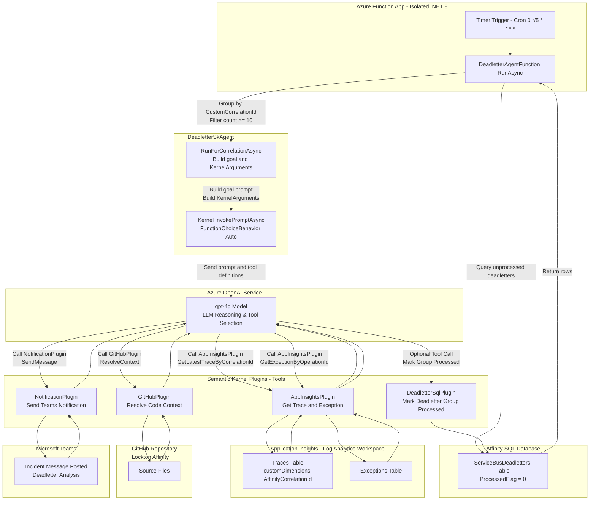
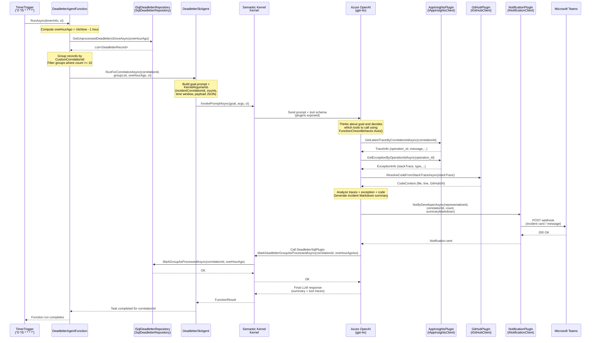
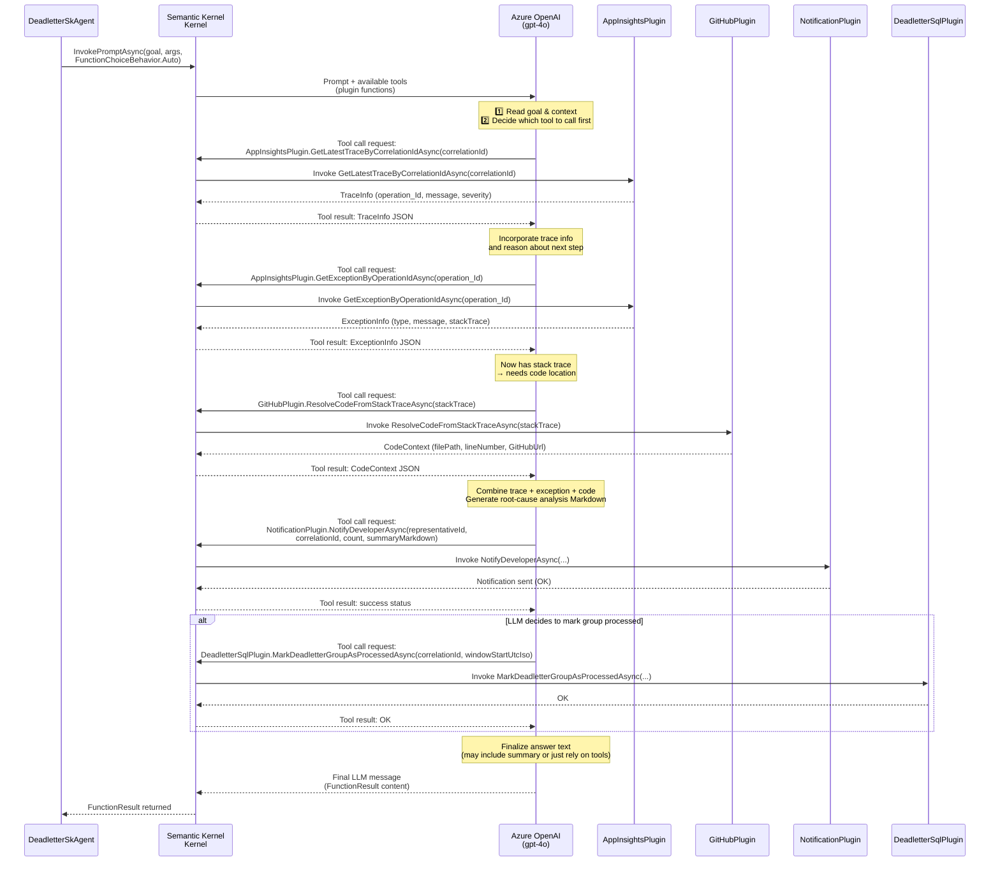
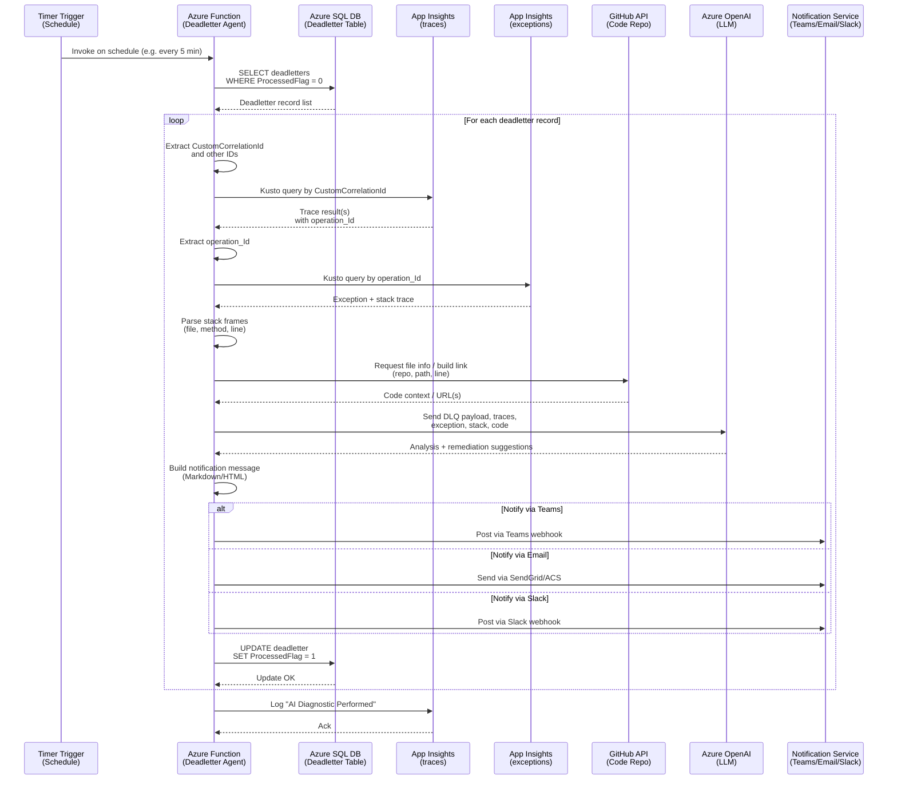

# Semantic Kernel Full Agent Solution

## Problem being solved

For each PEO deadletter, what is the root problem, where did it happen, and what is the recommended fix. This involves multiple pieces working together:

	* AI Agent accessing:
	* SQL Database
	* Application Insights
	* GitHub
	* Teams

### Solution Process

The function that throws the deadletter could be caused by a deeper process than the function that threw the dead letter. For example, an Affinity API 
the function calls could have thrown the original exception. A developer might perform the following steps to find a solution.

	* Identify the repo for the deadletter
	* Identify the App from the repo
	* Identify the excpetion from the App AppInsight logs
	* Identify the Repo where the exception occurred
	* Reading and analyzing the repo GitHub code
	* Marking the deadletter record as processed

## AI Agents

Went down several paths trying to understand the various AI technologies. But two always kept coming up in one form or another, Semantic Kernel and
Azure AI Agent Service (Azure AI Foundary). Depending on when and how I asked the question, I was getting different answers as to which was better.
Semantic Kernel is a Microsoft SDK and does provide some flexibility, as originaly touted, but has drawbacks as I later learned. 

Trying to get a handle on all the terms and exactly what they truely mean. Going down the path of Semantic Kernel certainly helped me get a better handle 
on how things Workflow as you have more control and are forced to implement more things. Learnig the difference between Chatbots, agents, full vs workflows,
LLMs, etc. 

* Azure AI Foundary
	- Pros
		- Low Code
		- Memory built-in
		- Automatically handles many of the low level details like queries, etc.
	- Cons
		- Cannot be implemented in code
		- Cannot be version controlled
* Semantic Kernel
	- Pros
		- Implements in a function
		- Very Flexible
		- Illustrates how to implement agent in code
		- Can be version controlled
	- Cons
		- Have to handle memory
		- Have to handle all the details, i.e. connections to GitHub, AppInsights, etc.
		- Have to write the queries, kusto & SQL
	- Two approaches
		- Workflow
			- Agent only used to analyze code
		- Full Agent
			- Agent given connection to all the services and determines how to get to the code and analyze it.

### Issues

* Memory
	- Application and Process Code Stucture
	- Previous issues/fixes
	
## Learnings

	* Copilot Instructions files
	* Logging Standards needed
	* Use of Correlation Ids
		- Fortunately, due to some Lee put in place, was able to use these for PEO
	
## AI Mission Status 

Where things stand based on the time spent so far. Most of my time was spent on research, with a little spent on building Semantic Kernel Frameworks, 
but no working POC yet.

## Proposal

Because I am still lacking understanding of the Azure AI Foundary, but other are working on understanding. Proposing that the Semantic Kernal Full Agent 
approach be implemented for the following reasons:

	* Gain understanding in how to embed agents in AFfinity's code base with greater control
	* Be able to track the various versions of this process 
	* Gain deeper insights in how to develop our applications (ex. logging, etc.)

## Full Agent Design Diagrams

The design for the current version of the Semantic Kernel Full Agent Framework are illustrated in the following diagrams.

### Data Flow

### Sequence Diagrams

A sequenceDiagram version that shows one concrete run for a single CorrelationId hitting the “10 in last hour” threshold, step-by-step.

### Sequence Diagrams - tool-calling loop

The sequenceDiagram just for the tool-calling loop (Kernel ↔ LLM ↔ plugins)

# Semantic Kernel Workflow w/Agent Solution

Simplier more deterministic approach.

## Workflow w/Agent Design

### Dataflow Diagram(s)

```mermaid
flowchart TD
    %% =============================
    %% Deadletter Diagnostic AI Agent
    %% =============================

    %% Triggers & Entry
    TMR[Timer Trigger<br/>e.g. every 5 minutes] --> FN_START[Azure Function<br/>Deadletter Diagnostic Agent]

    %% Step 1: Read new deadletters from SQL
    FN_START --> SQL[Azure SQL DB<br/>Deadletter Table]
    SQL -->|SELECT new rows<br/>WHERE ProcessedFlag = 0| DLQ_ROWS[New Deadletter Records]

    DLQ_ROWS -->|For each record| EXTRACT_IDS[Extract identifiers<br/>CustomCorrelationId and others]

    %% Step 2: Query App Insights for traces
    EXTRACT_IDS --> AI_TRACES[Azure Application Insights<br/>Traces]
    AI_TRACES -->|Kusto query by<br/>CustomCorrelationId| TRACE_RESULT[Trace Results]
    TRACE_RESULT -->|Get operation_Id| GET_OPID[Resolve operation_Id]

    %% Step 3: Query App Insights for exceptions
    GET_OPID --> AI_EXC[Azure Application Insights<br/>Exceptions]
    AI_EXC -->|Kusto query by<br/>operation_Id| EXC_RESULT[Exception and Stack Trace]

    %% Step 4: Map stack trace to GitHub source
    EXC_RESULT --> MAP_STACK[Parse stack trace<br/>assembly class method file line]
    MAP_STACK --> MAP_PATHS[Map build paths →<br/>repo paths]
    MAP_PATHS --> GITHUB[GitHub API<br/>Affinity repos]
    GITHUB --> CODE_CTX[Code context<br/>file snippet and links]

    %% Step 5: AI reasoning
    EXTRACT_IDS --> AGG_DATA[Aggregate context<br/>DLQ payload IDs timestamps]
    TRACE_RESULT --> AGG_DATA
    EXC_RESULT --> AGG_DATA
    CODE_CTX --> AGG_DATA

    subgraph LLM[AI Reasoning Engine<br/>Azure OpenAI / LLM]
        AGG_DATA --> PROMPT[Construct prompt with<br/>logs stack and code]
        PROMPT --> CALL_LLM[Call model<br/>analyze and suggest fixes]
        CALL_LLM --> LLM_OUT[AI Analysis and<br/>Suggested Fixes]
    end

    %% Step 6: Notify developers
    LLM_OUT --> FORMAT_MSG[Build dev-friendly summary<br/>Markdown or HTML]
    FORMAT_MSG --> NOTIFY_CHOICE{Notification channel}

    NOTIFY_CHOICE -->|Teams| TEAMS[Post to Teams channel<br/>webhook or Graph]
    NOTIFY_CHOICE -->|Email| EMAIL[Send email<br/>SendGrid or ACS]
    NOTIFY_CHOICE -->|Slack| SLACK[Post to Slack channel<br/>webhook]

    %% Step 7: Mark record as processed
    NOTIFY_CHOICE --> UPDATE_SQL[Update Deadletter row<br/>set ProcessedFlag = 1]
    UPDATE_SQL --> SQL_DONE((Deadletter marked<br/>as processed))

    %% Optional: Feedback loop / metrics
    LLM_OUT --> METRICS[Log AI decision and context<br/>to App Insights or table]
    METRICS -->|Future tuning and audits| FN_START

    %% Legend styling
    classDef service fill:#e3f2fd,stroke:#1e88e5,stroke-width:1px,color:#0d47a1;
    classDef data fill:#fff3e0,stroke:#fb8c00,stroke-width:1px,color:#e65100;
    classDef ai fill:#f3e5f5,stroke:#8e24aa,stroke-width:1px,color:#4a148c;
    classDef notif fill:#e8f5e9,stroke:#43a047,stroke-width:1px,color:#1b5e20;

    class TMR,FN_START,SQL,AI_TRACES,AI_EXC,GITHUB,TEAMS,EMAIL,SLACK service;
    class DLQ_ROWS,EXTRACT_IDS,TRACE_RESULT,GET_OPID,EXC_RESULT,MAP_STACK,MAP_PATHS,CODE_CTX,AGG_DATA,FORMAT_MSG,UPDATE_SQL,SQL_DONE,METRICS data;
    class LLM,PROMPT,CALL_LLM,LLM_OUT ai;
    class NOTIFY_CHOICE notif;

```

### Sequence Diagrams

